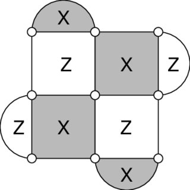

# Quantum error-correction primer for data engineers

You do not need prior quantum-computing coursework for this assignment. In your career as a Data Engineer / Data Scientist, you will often have to work with data of which you have no understanding of. At the begining of your job, it will be your task to get to understand the data before you can apply your data management skills. It is not important that understand how quantum phenomena work, only what the data looks like and what it is used for. 

## What this is, in data terms

Strip the physics away and the task has a shape you already know:

- A **parity check** is a parity bit computed over a small group of qubits: the
  same idea as a RAID parity block, or a checksum over a group of bytes.
- The machine recomputes every check **repeatedly**, so one run produces a
  stream of parity bits over time, not a single snapshot.
- A **detector event** is "this parity bit changed when nothing should have
  changed it": a flipped checksum, not a raw reading.
- A **decoder** is a binary classifier. It consumes those bits and predicts one
  bit: did the protected information get corrupted, or not?

So the modelling half of this assignment is binary classification over bit
patterns, and the data-management half is getting those bits out of compact
scientific formats without mixing up which is which. You need no quantum
mechanics for either. You need to know exactly which bits you are holding and
where they came from.

## One record, annotated

Before any vocabulary, look at the shape of the thing. A row of the simulated
syndrome CSV looks like this (columns real, values illustrative):

```text
labels,syndromes,quantity
0,"((0,0,0,0),(0,0,0,0),(0,0,1,0),(0,0,1,0))",1234
│  │                                          │
│  │                                          └─ 1234 simulated shots produced
│  │                                             exactly this pattern
│  └─ four rounds of four checks; check 2 fired in rounds 3 and 4
└─ none of those 1234 shots ended in a logical error
```

Sixteen parity bits went in, one label came out, and the row stands for 1234
repetitions rather than one. Almost every section below is a gloss on some part
of that single line.

## Physical errors and logical information

Physical qubits are noisy. Reading the information encoded in a qubitw will make it loose it's state, so in order to verify the corectness of quantum computations, additional qubits are introduced. Quantum error correction encodes logical information across several physical data qubits and repeatedly measures checks that reveal evidence of errors without directly measuring the protected logical state. There are two types of erros, X and Z. They are checked using different circuits. The difference between these 2 types of errors is beyond the scope of the assignment, what is important is knowing that there are two different error types.



    Stabilizer layout of a distance-3 surface code

### How to read that figure

It is a layout, not a circuit: it shows which checks exist and which qubits they
cover, not the order operations are executed in.

- The nine white circles are the **data qubits**.
- Every face is one **parity check**. The four shaded faces and lobes are X-type
  checks, the four white ones are Z-type: **eight checks in total**.
- The interior squares each cover four data qubits; the half-circle lobes on the
  boundary cover two.
- Each check is measured by one **ancilla qubit**, which this figure does not
  draw. Checks are what the data records; ancillas are how the records are
  obtained.

Carry that count of eight forward. It is where the detector widths in the Google
data come from.

Code distance is related to how many physical errors a code can detect or
correct. Larger distance generally uses more data and measurement qubits; the
provided data lets you compare distances three and five, but it does not justify
claiming that distance alone causes every observed difference.

## Data, ancilla, and measurement qubits

- **Data qubits** hold the encoded state.
- **Ancilla/measurement qubits** interact with data qubits to extract check
  information and are then measured.
- A circuit may use separate OpenQASM registers for these roles. `q[0]` and
  `a[0]` are different qubits even though both have local index zero.

## Parity or stabilizer check

A parity check asks whether a selected group of data-qubit values has even or
odd parity. Surface codes use X- and Z-type stabilizer checks. The precise
quantum operator is outside this assignment's data-engineering requirements;
what matters is the relationship:

```text
check definition -> participating data qubits -> ancilla -> measured bit
```

In the supplied repetition-code circuit, one ancilla checks data qubits 0 and
1, while another checks data qubits 1 and 2.

## Syndrome

A syndrome is a pattern of check outcomes that provides evidence about an
error. The simulated source contains sequences of four rounds by four check
values. A syndrome is not necessarily a unique error identifier: the same
sequence may appear with different logical-error labels, especially as noise
increases.

Therefore, syndrome alone may not be a valid primary key or safe deduplication
key.


## Repeated rounds and detector events

Checks are measured repeatedly. A raw measurement bit is the recorded result at
one measurement position. A detector event is a derived indication that a
specified parity relation between measurements is inconsistent with the
expected value.

```text
measurement bits + circuit definition + sweep bits
                         ↓
                  detector events
                         ↓
                       decoder
                         ↓
            predicted logical observable flip
```

The three inputs to that first arrow are worth naming, and note that one of them
is not a file of bits at all:

- **measurement bits** (`measurements.b8`): what the hardware actually recorded,
  one bit per measurement position;
- **circuit definition**: the annotations stating which measurements are
  compared with which, and what the noiseless expectation is;
- **sweep bits** (`sweep.b8`): the per-shot initialization/configuration bits
  describing how that particular shot was prepared. Because two shots prepared
  differently can have different noiseless expectations, identical measurement
  bits do not always produce identical detector events.

Do not label every measurement-one as an error and do not treat a detector bit
as if it were the original measurement.

A shot is one full execution of the circuit: one pass through all measurement
rounds, yielding one set of measurement bits, one syndrome, and one actual
logical-observable outcome. Aggregated rows summarize many shots; `quantity`
records how many shots a row stands for.

## Logical observable flip and decoder error

`obs_flips_actual.01` records whether the measured logical observable flipped
relative to the noiseless expectation. A decoder predicts that binary label
from detector events.

A decoder error occurs when:

```text
predicted_observable_flip != actual_observable_flip
```

An actual flip value of one is not automatically a decoder error; a correct
decoder may predict it.

## Weighted simulated aggregates

The simulated syndrome rows are aggregates. `quantity` tells how many shots one
row represents. Counts, rates, and distributions must therefore use quantity as
a weight. Expanding all aggregated shots would add cost without adding
information.

## Stim `b8` and `01` formats

The experimental source uses two compact formats:

- `b8`: bits packed into little-endian bytes; every shot starts on a byte
  boundary, so unused high bits in the final byte are padding;
- `01`: human-readable zero/one text, with one experiment value per line in the
  supplied observable files.

Always derive expected byte/line counts from `properties.yml` before parsing.

## From QEC records to model examples

The feature/label boundary follows the operational decoder task:

```text
past/current syndrome or detector evidence -> predicted logical flip
actual logical flip                         -> supervised target
```

Decoder correctness is computed after prediction and is never a feature. For
the weighted simulation data, `quantity` is a physical multiplicity, not an
input signal. For the Google combined decoder, existing decoder predictions may be
features because Task B asks whether their mistakes complement one another;
the actual flip remains the target.

The supplied syndrome split holds out complete physical-fault-rate files. The
Google split uses repeatable shot-index groups inside every experiment. Training
rows are used for fitting, validation rows for choices, and test rows only for
the final reported metrics.

## OpenQASM parsing cautions

OpenQASM includes declarations, custom gate definitions, operations,
measurements, barriers, and conditional operations. A gate body defines an
operation; it is not an execution until invoked. Conditional statements such as
`if(syn==1) x q[0];` connect one syndrome value to a recovery operation.

For this assignment, parse structure and QEC relationships. Do not simulate the
programs.

## Source-specific vocabulary

- **surface code**: a topological QEC code based on local checks;
- **repetition code**: a simpler code useful for illustrating parity checks;
- **decoder**: algorithm predicting a logical correction from syndrome or
  detector data;
- **detector event**: a derived indication that a specified parity relation
  between measurements (across rounds and/or check type) is inconsistent with
  the expected, noiseless value; not a raw measurement bit itself;
- **round**: one full pass in which every check is measured once; the Google
  experiments use 25 rounds per shot, the simulated rows four;
- **shot**: one execution of the circuit through all its rounds, producing one
  set of measurement bits and one actual logical outcome;
- **basis (X or Z)**: which of the two error/measurement types an experiment is
  run in; the supplied Google experiments are all X-basis;
- **logical observable**: the protected piece of information the code defends;
  the quantity whose final value the decoder is ultimately trying to get right;
- **sweep bits**: per-shot initialization/configuration bits in `sweep.b8`,
  needed to know what the noiseless expectation was for that shot;
- **physical fault rate**: simulated probability/rate parameter encoded in the
  compact dataset filenames;
- **noise model**: the assumed probabilities and mechanisms of physical faults;
  the simulated files vary it explicitly through the physical fault rate;
- **location**: the processor-center coordinates encoded in the Google directory
  names; distance-three experiments at different locations use different
  physical qubits, which is what makes one location a meaningful held-out group;
- **transpilation**: conversion/optimization of a circuit for a target gate set
  and hardware constraints;
- **matching / MWPM**: minimum-weight perfect matching, the classical
  graph-based decoder family behind several supplied `obs_flips_predicted_by_*`
  outputs;
- **combined decoder (or meta-decoder)**: learned model that combines outputs
  from other decoders;
- **logical-error rate (LER)**: fraction of physical observations for which a
  decoder prediction differs from the actual logical outcome;
- **calibration**: agreement between predicted probabilities and observed
  frequencies, summarized here with the Brier score.
